# Bases de Datos
**Dylan Alves Pinto** 

## TEMA 3


## Parte practica

- **`Nombre de Entidades:`** Utiliza mayúsculas y negrita para destacar el nombre de las entidades.

- **`Clave Primaria:`** Subraya la clave primaria para identificarla claramente.

- **`Atributos Opcionales:`** Se indica con un asterisco (*) para representar que pueden tener valores nulos.

- **`Identificadores Alternativos:`** Utiliza negrita para resaltar identificadores alternativos.

- **`Atributos Compuestos:`** Para atributos compuestos, se especifica cada una de las partes, excepto en el caso de fechas.

- **`Atributos Multivaluados:`** Si no se indica nada, se asume que el primer atributo es obligatorio y el segundo opcional con un asterisco (*), o ambos son obligatorios.

- **`Claves Foráneas:`** Se representan en cursiva (k) y se subrayan si son primarias.

## Tipos de Cardinalidades

- **`N:M (Muchos a Muchos):`** Involucra las claves foráneas de ambos lados.

- **`1:N (Uno a Muchos):`** La clave de "*`1`*" se traslada a "*`N`*" indicando la relación.

- **`N:1 (Muchos a Uno):`** Similar a 1:N, pero ahora la relación es de muchos a uno.

- **`1:1 (Uno a Uno):`** Se requiere revisar ambos lados; es crucial evitar valores nulos.
    - Ejemplo: (0,1) en ambos lados pasa a (1,1).
    - Si hay (0,1) en ambos lados, se crea una tabla nueva.

**`Importante: En caso de cardinalidades (1,1), es obligatorio; si es (0,1), se admiten valores nulos.`**

## Acciones de Borrado y Modificación

- **`Restringidos:`** Al intentar borrar en la entidad origen, verifica si hay datos en otras tablas. No permite el borrado si existen datos relacionados. Se recomienda borrar de abajo hacia arriba.

- **`Cascada:`** El borrado en la entidad origen resulta en la eliminación de todas las filas en las que estaba presente esa entidad. Por ejemplo, al borrar una entidad "profe", se eliminarán todas las filas relacionadas con ese profesor.

- **`Nulos:`** Al realizar un borrado, se asigna el valor "*NULL*". Para permitir valores nulos, la clave debe tener un asterisco (*).

- **`Compuesto con Valor por Defecto:`** Al realizar un borrado, se asigna un valor por defecto predefinido, como "*Por defecto: 99*".

---

## Parte teórica

# Modelo Relacional Resumen Básico

El **modelo relacional** es un enfoque para organizar y estructurar datos en una base de datos, propuesto por Edgar Codd en la década de 1970.

## Tabla

- Los datos se organizan en **tablas**, cada una con un nombre único, compuesta por filas (*tuplas/registros*) y columnas (*atributos/campos*).
- Cada celda contiene un valor único y atómico del tipo de datos definido para esa columna.

## Clave Primaria

- Cada tabla tiene una o más columnas que sirven como **clave primaria**, identificando de manera única cada registro.
- Garantiza la integridad de los datos y facilita el acceso eficiente a los registros.

## Relaciones

- Se establecen mediante **claves foráneas**, donde una columna hace referencia a la clave primaria de otra tabla.
- Permite vincular información entre diferentes tablas y garantizar la consistencia de los datos.

## Normalización

- Proceso para organizar los datos y reducir la redundancia, mejorando la integridad.
- Divide la información en tablas más pequeñas y relacionadas para evitar la repetición de datos y minimizar anomalías.

## Operaciones

- Define operaciones básicas como *SELECT* (recuperar datos), *INSERT* (agregar registros), *UPDATE* (modificar registros) y *DELETE* (eliminar registros).

## Integridad Referencial

- Garantiza que las relaciones entre las tablas sean coherentes y evita claves foráneas huérfanas.


<br>
<br>
<br>

---

### Principal Objetivo del Modelo Relacional

El modelo relacional se propone como principal objetivo, aislar al usuario de las estructuras fisicas de los datos, consiguiendo así la independencia entre aplicaciones y datos.


### Teoria matemática del Modelo Relacional

Este modelo de datos tiene una amplia teoría matemática que lo respalda: `la Teoría Matemática de las relaciones`

Avances:

- ``Uniformidad``: 
  - Los usuarios de la BD Relacional ``la ven como una colección de tablas``.
  - ``La relación``

- ``Sencillez``:
  - El concepto de tabla como un conjunto de filas y columnas es fácil de entender.
  - Emplea lenguajes de tratamiento de datos muy sencillos 

- ``Sencilla fundamentacón teórica``:
  - Álgebra relacional
  - Cálculo relacional de tuplas (CRT) (Una tupla es una fila)

- ``Independencia de la interfaz de usuario``:
  - La independencia de la interfaz de usuario facilita la gestión de datos, ya que los usuarios pueden concentrarse en lo que desean hacer con la información sin tener que preocuparse por cómo está organizada internamente.

### Partes de un modelo de datos

Todo modelo de datos es una combinación de 3 componentes agrupados en 2 partes, la estática y la dinámica.

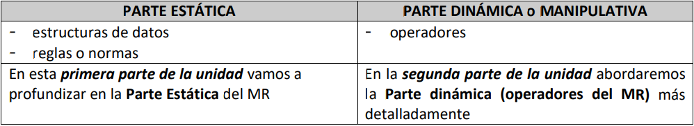 

En el contexto de los modelos de datos, la **parte estática** y **dinámica** se refiere a dos aspectos distintos:

## Parte Estática del Modelo de Datos

### Definición de Estructura:
En esta parte, se describe la **estructura** de la base de datos, incluyendo **tablas**, sus **columnas** y las **relaciones** entre ellas.

### Entidades y Atributos:
Se definen las **entidades** (objetos o conceptos) y los **atributos** (características) asociados a esas entidades.

### Restricciones:
Se especifican las **restricciones de integridad** y las **claves primarias y foráneas** que garantizan la consistencia de los datos.

## Parte Dinámica del Modelo de Datos

### Comportamiento y Acciones:
En esta parte, se describe cómo cambian los datos con el tiempo y cómo **interactúan** las entidades.

### Operaciones y Transiciones:
Se definen las **operaciones** que pueden realizarse en la base de datos, como inserciones, actualizaciones y eliminaciones.

### Eventos y Actividades:
Se identifican los **eventos** que desencadenan cambios en los datos y las **actividades** que se realizan como respuesta a esos eventos.

**En resumen,** la parte estática se centra en la **estructura y características** de los datos, mientras que la parte dinámica se ocupa de **cómo esos datos cambian y se manipulan a lo largo del tiempo**. Ambas partes son esenciales para comprender y diseñar un modelo de datos completo y funcional.


### Estructuras de datos

- La ``estructura básica y única`` del Modelo Relacional es la **``relación``**, también llamada ``informalmente tabla``, que sirve para representar tanto los objetos como las asociaciones entre ellos.

(*``Podemos decir que la tabla es la representación de la relación en el MR``*)

- Los atributos son las propiedades de las relaciones y se definen sobre los dominios.


### Elementos del modelo DOMINIOS, ATRIBUTOS Y RELACIONES

El Universo del Discurso (UD), representación del mundo real o también llamada Minimundo de
una BDR.

### Dominios:

**Dominios (D):** Conjunto de datos del mismo tipo.

- Cada dominio tiene un **nombre** y un **formato**:
  - Por **extensión:** Proporciona todos sus valores.
  - Por **intensión:** Se define mediante un tipo de datos.

- A veces se asocia al dominio su **unidad de medida** (kilos, metros, etc.) y ciertas **restricciones**, como un rango de valores.

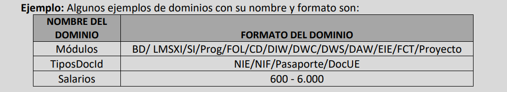 

Los dominiosse pueden clasificar en:

- ``Generales``: toma valores entre un minimo y un maximo. En el ejemplo anterior el dominio "Salarios".
- ``Restringidos``: toma valores entre unos especificos. En el ejemplo anterior, los dominios "Módulos" y "TiposDocId"

### Atributos:

- Atributo (A): Interpretación de determinado dominio en una relación, es decir, el papel que desempeña en esa relación.

Un atributo y un dominio PUEDEN llamarse igual,pero deber tenerse en cuenta que:

-Un atributo está siempre asociado a una relación (tabla)
  - Un atributo representa una propiedad (una caracterstica) de una relación (tabla)

-  Un dominio exsiste sin depender de una relación (tabla):
   -  varios atributos distintos pueden tomar sus valores del mismo dominio

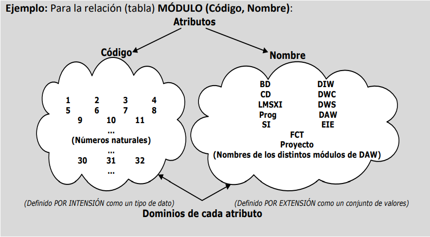

```
Ejemplo: El atributo DNI de la relación ALUMNO y el atributo DNI de la relación PROFESOR,
están definidos sobre el mismo dominio de nombre números_enteros_positivos.
```

### Relación: FALTA EXPLICACION

- Definición fromal de relación (R): 


### CLAVES

- Clave ``primaria``: Conjunto minimo de atributos cuyos valores indentifican unívocamente a una tupla en una relación.
  
- Clave ``candidata`` o ``alternativa``: Son claves que podrian ser primarias (puede haber mas de 1)

- Clave ``foránea``: Puedes tener varias y vienen de fuera


### TERMINOLOGÍA

| Término Formal (MR) | Término Informal para Ficheros |
|----------------------|--------------------------------|
| Relación             | Tabla                          |
| Atributo             | Columna o Campo                |
| Tupla                | Fila o Registro                |
| Grado                | Número de Columnas             |
| Cardinalidad         | Número de Filas                |
| Clave Primaria       | Identificador Único            |
| Dominio              | Conjunto de Valores Posibles   |
| Esquema de Relación  | Descripción de la Tabla        |

### RESTRICCIONES (o reglas) INHERTES

## Restricciones Inherentes del Modelo Relacional (MR)

1. **Restricción de Obligatoriedad de Clave Primaria:**
   - En una relación, no puede haber tuplas iguales. Esto implica que la clave primaria es obligatoria y única para cada tupla en la relación.

2. **Irrelevancia del Orden de Tuplas y Atributos:**
   - El orden de las tuplas y el de los atributos no es relevante. Las consultas y manipulaciones de datos no dependen del orden en que se ingresaron o del orden de los atributos en la relación.

3. **Unicidad de Valores para Cada Atributo:**
   - Cada atributo solo puede tomar un único valor del dominio sobre el que está definido. Esto garantiza la consistencia de los datos y evita ambigüedades.

4. **Restricción de Integridad de Entidad:**
   - Ningún atributo que forme parte de la clave primaria de una relación puede tomar un valor nulo. Esto asegura que la clave primaria, que identifica de manera única cada tupla, siempre esté presente y no pueda ser nula.

Estas restricciones son inherentes al modelo y ayudan a mantener la coherencia y la integridad de los datos en una base de datos relacional.

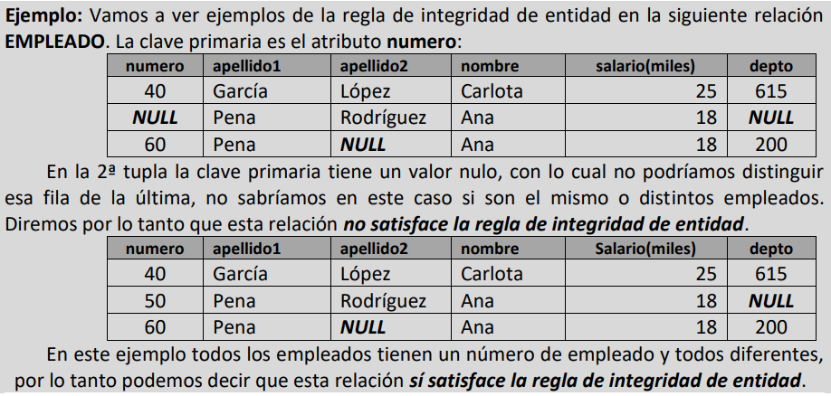

### RESTRICCIONES SEMÁNTICAS O DE USUARIO

Son herramientas que el diseñador utiliza para personalizar el esquema de relación de una base de datos. Estas restricciones permiten capturar detalles específicos del dominio, mejorar la precisión del modelo y adaptarse a las necesidades particulares del usuario. Su importancia radica en asegurar que la base de datos refleje de manera fiel la realidad que se está modelando, siendo esenciales durante el diseño de bases de datos.

Las restricciones semánticas del MR son las siguientes:

1) RESTRICCIÓN DE CLAVE PRIMARIA (Primary key): permite declarar un atributo o conjunto de atributos como la clave primaria de una relación. Esta clave primaria tiene la función de identificar de manera única cada tupla dentro de la relación, asegurando que no haya duplicados y proporcionando una forma única de referenciar cada registro en la tabla.
    
2) RESTRICCIÓN DE UNICIDAD (Unique): nos permite definir claves alternativas.
   
3) RESTRICCIÓN DE OBLIGATORIEDAD (Not Null): esta restricción asegura que los atributos designados deben tener información válida en cada tupla de la relación y no pueden quedar sin información (NULO). Esto garantiza la integridad de los datos y ayuda a evitar inconsistencias en la base de datos.
   
4) RESTRICCIÓN DE CLAVE AJENA ó DE INTEGRIDAD REFERENCIA (Foreign Key): Permite enlazar relaciones (tablas) de una BD. La restricción de clave ajena es como un "enlace" entre dos tablas en una base de datos. Imagina que tienes una tabla de "Clientes" y otra de "Pedidos". La restricción de clave ajena asegura que, por ejemplo, si tienes un "ID_Cliente" en la tabla "Pedidos", ese ID realmente exista en la tabla "Clientes". 
   
5) RESTRICCIÓN DE VERIFICACIÓN (Check): Permite establecer condiciones específicas que los datos deben cumplir al ingresar o modificarse en una tabla. Define reglas o condiciones que los valores de un atributo deben cumplir. Por ejemplo, podrías tener una restricción de verificación que asegure que la edad de una persona sea mayor de 18 años.
   
6) RESTRICCIÓN DE ASERCIÓN ó ASERTOS (Assertion): permite establecer reglas más complejas y específicas en tu base de datos para adaptarse a las necesidades particulares de tu aplicación.
   
7) DISPARADORES (Trigger): Los triggers son como "guardianes automáticos" que se activan cuando sucede algo en la base de datos, permitiendo ejecutar acciones específicas para mantener la integridad y realizar tareas automatizadas.


## FUNDAMENTACIÓN MATEMÁTICA DEL MODELO RELACIONAL

Parte dinamica del MR:

- Álgebra relacional
- Normalizacion de Relaciones

## ALGEBRA RELACIONAL

El algebra relacional es propia del Modelo Relacional  y se puede cosiderar como`` lenguaje  de consulta procedimental``:
- ``de consulta``: porque mediante él se solicita información contenida en la Base de Datos.
- ``procedimental``: porque es necesario indicar la secuencia de operaciones a realizar sobra la base de datos para obtener el resultado.

## TIPOS DE OPERACIONES DE ÁLGEBRA RELACIONAL

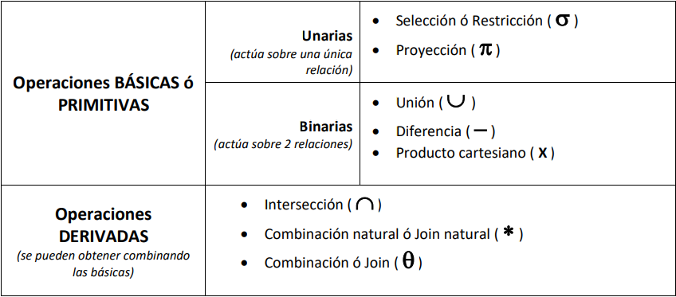

### SELECCIÓN Ó RESTRICCIÓN 

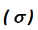

La seleccion o restriccion se utiliza para seleccionar las tuplas que cumplen con ciertas condiciones de una relación.
Ejemplos:

- Seleccionar empleados de un departamento:
  - Departamento = `"Ventas"`

  - Esto seleccionará todas las tuplas de la relación "Empleados" donde el departamento sea 'Ventas'.

- Seleccionar pedidos realizados después del 1 de enero de 2023:
    - Fecha_pedido>`"2023-02-02"`


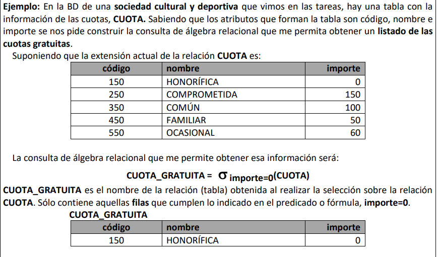

### PROYECCIÓN
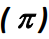

Se utiliza para seleccionar columnas específicas de una relación, descartando el resto de las columnas.

Seria el SELECT en SQL

```sql
SELECT Nombre, Saldo FROM Clientes;
```

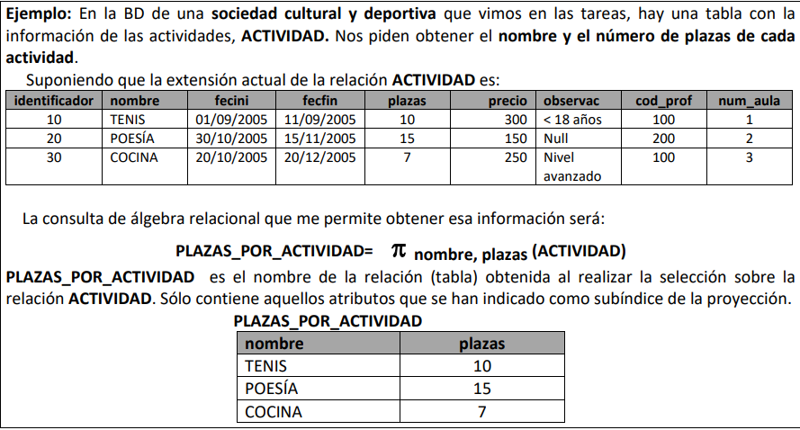

### UNION
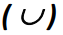

Se utiliza para combinar las tuplas de dos relaciones que tienen el mismo esquema, es decir, las mismas columnas. Es SQL, la union se realiza utilizando la cláusula "UNION"

```sql
SELECT * FROM EmpleadosNuevos
UNION
SELECT * FROM EmpleadosAntiguos;
```

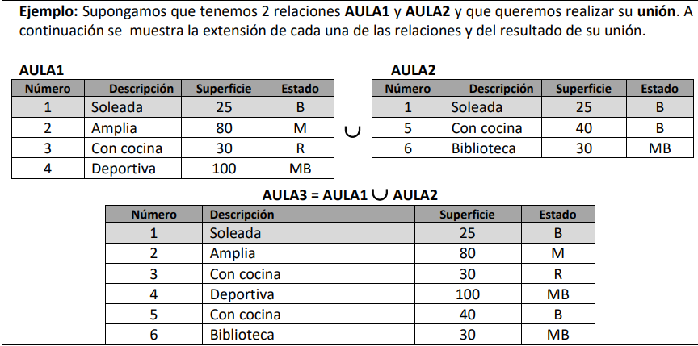

### DIFERENCIA

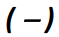

En algebra relacional se utiliza para obtener las tuplas de una relación que no están presentes en otra relación.

En SQL, la diferencia se logra mediante la cláusula "EXCEPT".

```sql
SELECT * FROM EmpleadosEnProyecto
EXCEPT
SELECT * FROM EmpleadosEnVacaciones;
```


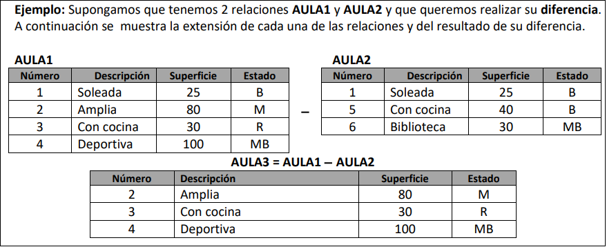


### Producto cartesiano

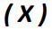

Combina todas las tuplas de dos relaciones, generando una nueva relacion donde cada tupla de la primaera relacion se combina con cada tupla de la segunda relacion.

En SQL, la operación de producto cartesiano se puede lograr simplemente listando las tablas en la cláusula FROM sin ninguna condición de unión. Aquí está el ejemplo en SQL:

```sql
SELECT * FROM Empleados, Departamentos;
```

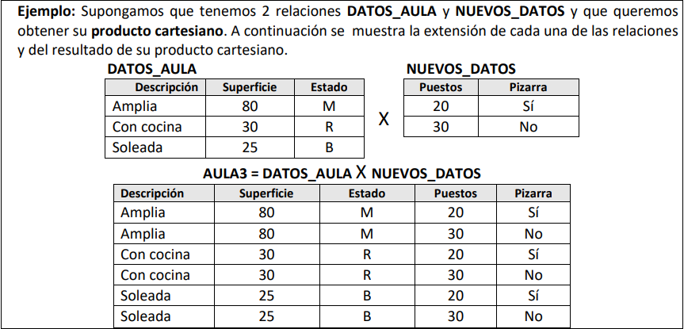

### Intersección

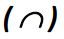

Se utilza para obtener las tuplas que están presentes en ambas relaciones.

En SQL, puedes utilizar la cláusula INTERSECT para lograr la misma operación.

```sql
SELECT * FROM EmpleadosEnProyecto
INTERSECT
SELECT * FROM EmpleadosEnVacaciones;
```

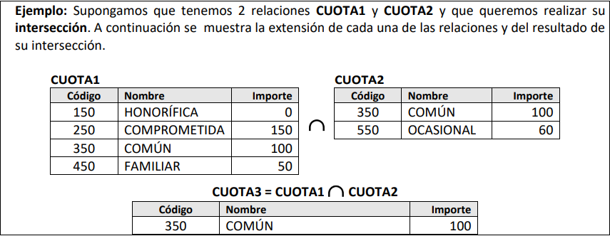

### Combinación natural ó Reunión natural o Join natural


Combina las tuplas de dos relaciones basandose en las columnas que tiene el mismo nombre y mismo valor en ambas relaciones.

```sql
SELECT * 
FROM Empleados
NATURAL JOIN Departamentos;
```

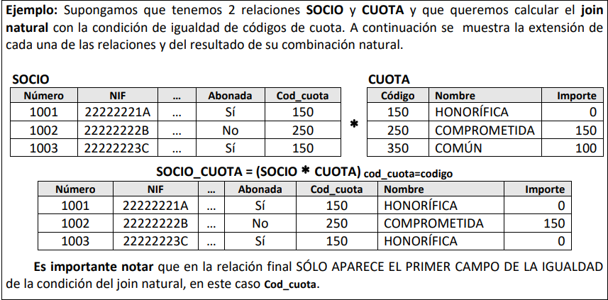

### Combinación ó Reunión ó Join

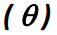

Se utiliza para combinar las tuplas de dos relaciones basándose en una condición de igualdad entre columnas especificadas.

```sql
SELECT *
FROM Empleados
JOIN Departamentos ON Empleados.DepartamentoID = Departamentos.DepartamentoID;
```

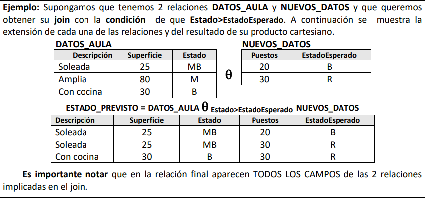

### NORMALIZACION DE RELACIONES

Los pasos a seguir para `modelizar un minimundo` son:

- Análisis del problema
- Obtener el diagrama EER
- Paso del EER al MR
- Realizar las consultas principales en álgebra relacional
- Implantar el modelo resultante en un SGBD relacional (SQL Server,Oracle...)

### Relacion Universal

Es una relacion (tabla) del MR que ``reúne todos los atributos de una base de datos en una única relación`` o tabla.

Problemas:
- Actualización
- Borrado
- Inserción

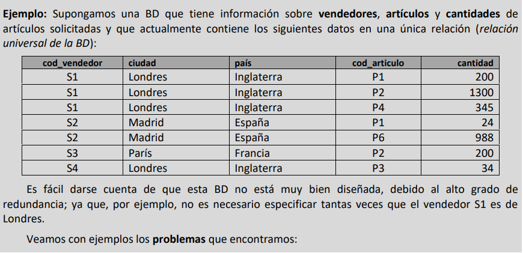


### Formas Normales
Las formas normales son una serie de reglas que, de cumplirse, aseguran que el esquema diseñado tendrá un buen comportamiento en cuanto a redundancia, pérdida de información y representación de la misma.

``TODAS`` las relaciones obtenidas al pasar de EER a MR deben estar ``como mínimo`` en ``Tercera Forma Normal (3FN)``.

- La primera Forma Normal (1FN)
- La segunda Forma Normal (2FN)
- ``La tercera Forma Normal (3FN)``


#### La primera Forma Normal (1FN)

Asegura que los valores en cada celda de la tabla sean atómicos y no haya repeticiones ni atributos multivaluados.

#### La segunda Forma Normal (2FN)

Elimina dependencias parciales asegurando que todos los atributos no primos dependan completamente de la clave primaria.

#### La tercera Forma Normal (3FN)

Elimina dependencias transitivas garantizando que ningún atributo no primario dependa transitivamente de la clave primaria.


